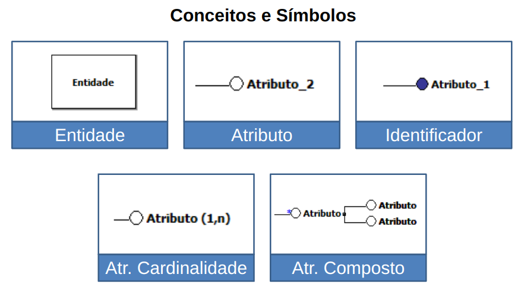
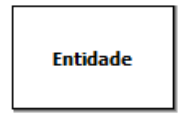
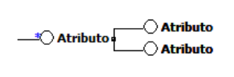
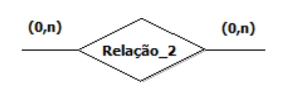
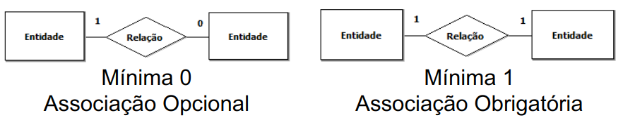
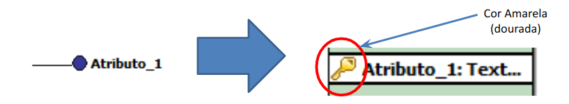

# SQL - Study

SQL (Structured Query Language) é uma linguagem de programação utilizada para gerenciar e manipular bancos de dados relacionais. É amplamente empregada para realizar consultas, inserções, atualizações e exclusões de dados em um banco de dados, além de ser utilizada para definir e modificar a estrutura das tabelas e relacionamentos dentro do banco de dados.

## Como instalar?

> Para usuários de Linux!
>
> Eu considero o DB MySQL o melhor para aprendizado, então seguirei com ele para esse estudo.

1. Atualizar pacotes

```bash
sudo apt update && sudo apt upgrade -y
```

2. Instalar o MySQL Server

```bash
sudo apt install mysql-server
```

3. Verificar status do MySQL

```bash
sudo systemctl status mysql
```

4. Iniciar, Parar e Reiniciar o MySQL (Opcional)

    - Para iniciar o MySQL

    ```bash
    sudo systemctl start mysql
    ```

    - Para parar o MySQL

    ```bash
    sudo systemctl stop mysql
    ```

    - Para reiniciar o MySQL

    ```bash
    sudo systemctl restart mysql
    ```

5. Acessar o MySQL

```bash
sudo mysql -u root -p
```

## Funcionalidades principais:

- **[DDL:](docs/DDL.md)** Linguagem de Definição de Dados;

- **[DML:](docs/DML.md)** Linguagem de Manipulação de Dados;

- **[DQL:](docs/DQL.md)** Linguagem de Consulta de Dados;

- **[DCL:](docs/DCL.md)** Linguagem de Controle de Dados;

- **[DTL:](docs/DTL.md)** Linguagem de Transação de Dados.

<!-- --- -->
<!-- </br></br></br></br></br></br></br></br></br></br></br> -->

## Um pouco de história - Modelagem de Dados

Um modelo de dados é uma descrição dos tipos de informações que estão armazenadas em um banco de dados.

Dentre as técnicas utilizadas para construção dos modelos utiliza-se “linguagem de modelagem de dados”, que podem ser gráficas ou textuais.

A técnica de modelagem de dados mais difundida e utilizada é a abordagem entidade-relacionamento (ER). Nesta técnica, o modelo de dados é representado através de um modelo entidade-relacionamento (MER). Usualmente, um MER é representado graficamente, através de um diagrama entidade-relacionamento (DER). 

A abordagem ER foi criada em 1976 por Peter Chen. Ela pode ser considerada como um padrão de fato para modelagem conceitual.

Mesmo as técnicas de modelagem orientada a objetos que têm surgido nos últimos anos baseiam-se nos conceitos da abordagem ER.

A maior dificuldade para o aprendizado das técnicas de modelagem em banco de dados é entender um problema do mundo real e converte-lo, criando uma solução.

O profissional da área de informática precisa entender o problema e conceituar o que será a solução e, para isso, duas coisas podem ser consideradas imprescindíveis: 

Saber ouvir o cliente/usuário abstraindo da conversa o que é realmente útil para implementar a solução;

Conhecer as técnicas de modelagem a fim de representar o problema de forma conceitual antes de iniciar a implementação.


SGBD (Sistema de Gerenciamento de Banco de Dados) é um software que gerencia o armazenamento, organização e acesso a dados. Exemplos incluem MySQL, Oracle Database, Microsoft SQL Server, PostgreSQL e MongoDB.

### Resumo

Um Banco de Dados contém Tabelas;

A Tabela é a estrutura interna de um Banco de Dados, essa estrutura contém Dados;

Uma Tabela é formada por Linhas e Colunas;

Cada Coluna é referente a uma Categoria de Dados de uma Tabela, também pode ser denominado Campo; 

Um Linha é denominado como Registro e contém todos os dados sobre um objeto a qual é representado pela Tabela.

### DER e Notações

- Notação de Peter Pin-Shan Chen (modelo conceitual)

- Notação de Carlos Alberto Hauser (modelo conceitual)

- Notação de James Martin (modelo físico)

- Notação de Charles Willian Bachman (modelo físico)

## Modelagem Conceitual



### Entidade

Uma entidade representa, no modelo conceitual, um conjunto de objetos da realidade modelada.



### Atributo

Atributo é igual ao espaço reservado para receber dado a cada ocorrência de uma entidade ou de um relacionamento. Cada atributo representam a informação associada.


### Identificador

Cada entidade deve possuir um identificador. Um identificador é um conjunto de um ou mais atributos cujos valores servem para distinguir uma ocorrência da entidade das demais ocorrências da mesma entidade.


### Atributo com Cardinalidade

A cardinalidade de um atributo define quantos valores deste atributo podem estar associados a uma ocorrência da entidade/relacionamento a qual ele pertence Esse atributo é representado por um par de valor, no qual o primeiro valor é a cardinalidade mínima e o segundo valor a cardinalidade máxima. Temos o atributo opcional quando a cardinalidade mínima é 0 (Zero) e/ou atributo multivalorado quando a cardinalidade máxima é N.


### Atributo Composto

O atributo composto é formado por um atributo base que da nome ao atributo, seguido dos atributos que fazem parte da sua composição. O numero máximo de níveis é 1 (um), ou seja, não é correto criar um atributo composto por outro atributo composto.



## Modelagem Lógica/Física

O modelo lógico é o resultado ou produto da conversão de um modelo conceitual para um determinado tipo de banco de dados, ou seja, nível de abstração visto pelo usuário do sistema gerenciador de banco de dados.

O modelo físico é o resultado ou produto da conversão de um modelo lógico para um modelo direcionado a um SGDB específico, ou seja uma representação do modelo de acordo com as características do SGDB escolhido.


### Atributo com Identificador

No modelo lógico o atributo identificador é identificado como a Chave primária da tabela (entidade). É representando do símbolo de uma chave dourada na frente do nome do atributo, ou também pode ser indicado pelo prefixo “PK”.


### Atributo com Cardinalidade

Os atributos com cardinalidade, sejam eles opcionais ou multivalorados, são adicionados na entidade conforme a quantidade expressa na cardinalidade máxima. Também existe a possibilidade de criar uma outra tabela para adicionar esse atributo.


### Atributo Composto

No modelo conceitual apenas os atributos que fazem parte da composição aparecem dentro da entidade. O atributo base é Também existe a possibilidade de criar uma outra tabela para adicionar esse atributo, nesse caso o atributo base é utilizado para nomear a entidade.


### Tipos de Dados para os Atributos

| Tipo de Dado | Descrição                                           |
|--------------|-----------------------------------------------------|
| **CHAR(n)**      | Campo de texto limitado, sempre preenchido à direita com espaços, com tamanho fixo n. |
| **VARCHAR(n)**   | Campo de texto de tamanho variável, com tamanho máximo n. |
| **INT**          | Inteiro de tamanho normal.                           |
| **FLOAT(p)**     | Número de ponto flutuante pequeno, com precisão p.   |
| **DOUBLE(n, p)** | Número de ponto flutuante de tamanho normal, com precisão n e p. |
| **DECIMAL(n, p)**| Número de ponto flutuante de tamanho normal com tamanho fixo, com precisão n e p. |
| **DATE**         | Tipo de dado para armazenar datas no formato AAAA-MM-DD. |
| **TIME**         | Tipo de dado para armazenar horas no formato HH:NN:SS. |
| **DATETIME**     | Combinação de data e hora separada por espaço, no formato AAAA-MM-DD HH:NN:SS. |
| **TIMESTAMP**    | Combinação de data e hora separada por espaço, no formato AAAA-MM-DD HH:NN:SS. |
| **ENUM('val1', 'val2', ..., 'valN')** | Enumeração de valores, aceitando um valor do tipo texto ou número inteiro. |
| **BLOB**         | Campo para armazenar imagem ou texto muito grande, com tamanho máximo de 4294967295 ou 4GB. |

```sql
CREATE TABLE exemplo (
    char_column CHAR(10),
    varchar_column VARCHAR(255),
    int_column INT,
    float_column FLOAT(5,2),
    double_column DOUBLE(10,4),
    decimal_column DECIMAL(8,2),
    date_column DATE,
    time_column TIME,
    datetime_column DATETIME,
    timestamp_column TIMESTAMP,
    enum_column ENUM('valor1', 'valor2', 'valor3'),
    blob_column BLOB,
    unique_column VARCHAR(50) UNIQUE,
    not_null_column INT NOT NULL,
    default_column INT DEFAULT 0
);
```

### Opções: Integridade de Dados a nível de Atributo

| Modificador    | Descrição                                                                                   |
|----------------|---------------------------------------------------------------------------------------------|
| **NOT NULL**       | Impede a inclusão de valores nulos na coluna, tornando o campo obrigatório.                  |
| **AUTO_INCREMENT** | Gera automaticamente um número incremental para cada novo registro na coluna.                 |
| **UNIQUE**         | Garante a unicidade dos valores em uma coluna, não permitindo a duplicação de valores.       |
| **DEFAULT(valor)** | Define um valor padrão que será assumido na inserção de um novo registro, se não for fornecido um valor explícito para a coluna. |

***Exemplo de uso:***

```sql
CREATE TABLE exemplo (
    id INT AUTO_INCREMENT PRIMARY KEY,
    nome VARCHAR(50) NOT NULL,
    email VARCHAR(100) UNIQUE,
    status ENUM('ativo', 'inativo') DEFAULT 'ativo'
);
```

Neste exemplo, a coluna `id` terá valores incrementais automaticamente, a coluna `nome` é obrigatória e não pode ser nula, a coluna `email` deve ser única em toda a tabela e a coluna `status` terá o valor padrão `'ativo'` se nenhum valor for fornecido durante a inserção de um novo registro.

## Relacionamento

<!-- ### Conceitos e Símbolos  -->

### Tipos de Relação


Além de especificar os objetos sobre os quais deseja-se manter informações, uma das propriedades sobre as quais pode ser desejável manter informações é a associação entre objetos.




### Cardinalidade

Para fins de projeto de banco de dados, uma propriedade importante de um relacionamento é a de quantas ocorrências de uma entidade podem estar associadas a uma determinada ocorrência através do relacionamento. 
Esta propriedade é chamada de cardinalidade de uma entidade em um relacionamento.
Há duas cardinalidades a considerar: a **cardinalidade máxima** e a **cardinalidade mínima**.
	
#### Cardinalidade Mínima

Uma outra informação que pode ser representada por um modelo ER é o número mínimo de ocorrências de entidade que são associadas a uma ocorrência de uma entidade através de um relacionamento.

Podemos classificar os relacionamentos em:



#### Cardinalidade Máxima

A cardinalidade máxima pode ser usada para classificar relacionamentos binários. Um relacionamento binário é aquele cujas ocorrências envolvem duas entidades, como todos vistos até aqui. 

Podemos classificar os relacionamentos em:


### Cardinalidade Representação


### Sentido de Leitura


> “Um modelo lógico é uma descrição de um banco de dados no nível de abstração visto pelo usuário do sistema gerenciador de banco de dados”

### Conceito de Chave

O conceito básico para estabelecer relações entre linhas de tabelas de um banco de dados relacional é o da chave. 

- **Chave primária Simples / Compostas :** apenas uma coluna ou a combinação de duas ou mais colunas (Origem do Identificador);

    

- **Chave estrangeira:** A existência de uma chave estrangeira impõe restrições que devem ser garantidas em diversas situações (Origem do Relacionamento);

    

- **Chave alternativa:** Em alguns casos, os valores de uma coluna não pode ser repetidos, mesmo essa coluna não fazendo parte de uma chave primária, assim temos as chaves alternativas.

### Transformação

A transformação é em função da cardinalidade máxima usada para classificar relacionamentos binários.


O produto da transformação do relacionamento na modelagem lógica está dividido em :

- Tabela própria: O relacionamento vira uma nota entidade (tabela) recebendo o identificador das duas tabelas que fazer parte do relacionamento, tornando-se chave primária;

- Adição de Coluna: A entidade de maior cardinalidade máxima recebe o identificador da entidade de menor cardinalidade máxima;

- Fusão de Tabela: As duas entidade se tornam apenas uma e some o relacionamento;

#### Relacionamentos 1:1 (Conceitual)


#### Relacionamentos 1:n (Conceitual)


#### Relacionamentos n:n (Conceitual)


### Chaves Estrangeiras

```sql
CREATE TABLE nome_da_tabela (
	nome_campo tipo_campo ,
	
	FOREIGN KEY (nome_campo)
	REFERENCES nome_tabela_relacionada (nome_campo_relacionado)
);
```

***Exemplo:***

```sql
CREATE TABLE funcionario (
	departamento int,

	FOREIGN KEY 	(departamento) REFERENCES    departamento (codigo)
);
```

### Transformação - Relacionamentos 1:1


#### Fusão de Tabelas


***Exemplo:***

```sql
CREATE TABLE ENTIDADE_AB (
	ID_A INT NOT NULL,
	ID_B INT NOT NULL,
	PRIMARY KEY (ID_A, ID_B),
);
```

### Transformação - Relacionamento 1:n


#### Adição de Colunas


***Exemplo:***

```sql
CREATE TABLE ENTIDADE_A (
	ID_A INT NOT NULL,
	PRIMARY KEY (ID_A),
);

CREATE TABLE ENTIDADE_B (
	ID_B INT NOT NULL,
	ID_A INT,
	PRIMARY KEY (ID_B),
	FOREIGN KEY 	(ID_A) REFERENCES ENTIDADE_A (ID_A)
);
```

### Transformação - Relacionamento n:n


#### Tabela Pŕopria


***Exemplo:***

```sql
CREATE TABLE ENTIDADE_A (
	ID_A INT NOT NULL,
	PRIMARY KEY (ID_A),
);

CREATE TABLE ENTIDADE_B (
	ID_B INT NOT NULL,
	PRIMARY KEY (ID_B),
);

CREATE TABLE RELACAO (
	ID_A INT NOT NULL,
	ID_B INT NOT NULL,
	PRIMARY KEY (ID_A, ID_B),
	FOREIGN KEY 	(ID_A) REFERENCES ENTIDADE_A (ID_A)
	FOREIGN KEY 	(ID_B) REFERENCES ENTIDADE_B (ID_B)
);
```