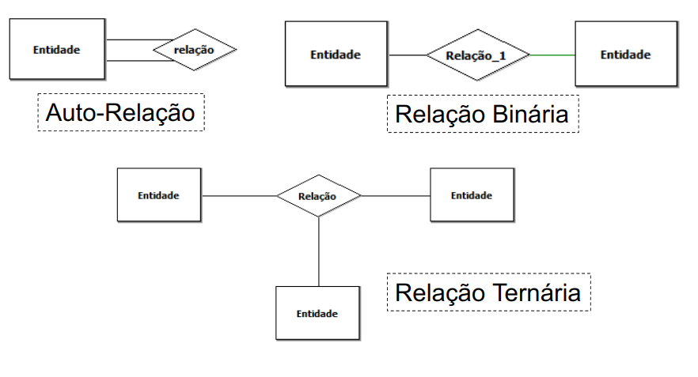

# 10 Steps to Conceptual Data Modeling

Based on the SQL Magazine Article 16 - 10 steps to creating a conceptual database model.

Before we delve into considerations about our conceptual model creation process, it is necessary to have knowledge of the following:

**Nouns** that designate someone (supplier, customer, employee, student), documents (invoice, order, current account, inventory) or even things (part, product) represent objects from the real world that may become part of the conceptual model.

**Verbs** and **prepositions**, on the other hand, serve to identify the relationship between entities, as they demonstrate the connections between them. For example, when we read in a text the phrase "List employees by department," we conclude that the entity "employee" has a type of relationship we can call "works in" with the department entity.

It is worth noting here that not all objects mentioned in the requirements will be part of the model, and to separate them we can use some simple rules which we will discuss below.

## Step 1

Identifying all nouns that designate objects.

## Step 2:

Discarding nouns that as entities would have only one occurrence.

Question: **If this noun were transformed into an entity, would it be a set of only one occurrence?**

## Step 3:

Discarding nouns that serve only to understand the problem.

Question: **Do I need to store information about this object?**

## Step 4:

Discarding objects that refer to a future application.

## Step 5:

Discarding nouns that if transformed into entities would have only one attribute.

Question: **If this entity were to become a table, how many columns would it have?**

## Step 6:

Listing the nouns that will become entities.

## Step 7:

Identifying the physical relationships and defining their types through verbs or prepositions that demonstrate relationships of dependence or existence between the entities.

## Step 8:

Establishing the degree of relationship between the entities.

## Step 9:

Establishing the cardinality ratio of the relationship between entities.

## Step 10:

Identifying the attributes of each entity.