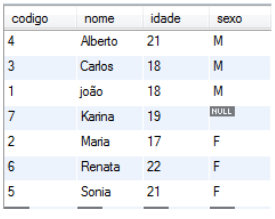

# Linguagem de Manipulação de Dados (DML)

Inclui comandos para inserir, remover, atualizar e consultar os dados armazenados nas tabelas.

## Principais comandos

```sql
INSERT
```

```sql
DELETE
```

```sql
UPDATE
```

## Inserção de registros

```sql
INSERT INTO nome_tabela (nome_campo_a, nome_campo_b, ..., nome_campo_n) VALUES (valor_campo_a, valor_campo_b, ..., valor_campo_n);
```

***Exemplo:***

```sql
CREATE TABLE CLIENTE (
	IDCLIENTE INT PRIMARY KEY AUTO_INCREMENT,
	NOME VARCHAR(10),
	SEXO CHAR(1),
	IDADE INT,
	CIDADE VARCHAR(20)
);

INSERT INTO CLIENTE ( NOME, IDADE) VALUES (‘JOÃO’, 12);
```

**Atenção:**

Qualquer valor que possa ir em coluna do tipo **VARCHAR**, **CHAR**, **DATE**, **TIME**, **DATETIME**, **TIMESTAMP** ou **BLOB** deve ficar entre aspas simples.

Os valores devem ser listados exatamente na mesma ordem que os nomes das colunas.

É possível deixar algumas colunas de fora do INSERT, desde que não sejam obrigatórias.

## Apagando registros

O comando **DELETE** serve para apagar dados da tabela. Esse comando utiliza a cláusula **WHERE** para restringir os registros que serão excluídos.

```sql
DELETE FROM nome_tabela WHERE condição;
```

***Exemplo:***

```sql
DELETE FROM CLIENTE WHERE IDCLIENTE = 1;
```

## WHERE

Operadores para a cláusula WHERE:


| Operador | Descrição          |
|----------|--------------------|
| **=**        | Igual              |
| **<>**       | Diferente          |
| **>**        | Maior que          |
| **<**        | Menor que          |
| **>=**       | Maior e igual a    |
| **<=**       | Menor e igual a    |
| **IN**       | Lista              |
| **LIKE**     | Que contenha       |
| **NOT**      | Negação            |
| **IS NULL**  | Somente valores nulos |
| **BETWEEN**  | Entre valores      |

## Alterando dados

O comando **UPDATE** serve para atualizar uma ou mais colunas, atribuindo valores novos. Esse comando utiliza a cláusula **WHERE** para restringir os registros que serão alterados.

```sql
UPDATE nome_tabela SET nome_campo = valor 
WHERE condição;
```

***Exemplo:***

```sql
UPDATE CLIENTE SET SEXO = ‘F’ WHERE IDCLIENTE = 7 AND SEXO IS NULL;
```

Para alterar mais de uma coluna utilize a vírgula.

```sql
UPDATE nome_tabela SET 
	nome_campo_1 = valor_1,
	nome_campo_2 = valor_2,
WHERE condição;
```

***Exemplo:***

```sql
UPDATE CLIENTE SET SEXO = ‘F’, IDADE = 21 
WHERE IDCLIENTE = 7;
```

## Consultando dados

```sql
SELECT * FROM nome_tabela
```

***Exemplo:***

```sql
SELECT * FROM CLIENTE
```


### WHERE

A cláusula **WHERE** indica ao SQL que deve procurar algo especifico. Ela limita os resultados, exibe somente as linha que são compatíveis com a condição estabelecida.

```sql
SELECT * FROM nome_tabela WHERE nome_campo operador valor
```

***Exemplo:***

```sql
SELECT * FROM CLIENTE WHERE CODIGO = 1
```

### Operador OR e AND

É possível utilizar os operadores lógicos OR e AND para combinar mais de uma condição na cláusula WHERE;

```sql
SELECT * FROM CLIENTE
WHERE
	(IDADE >= 18 AND SEXO = ‘M’) OR
	(IDADE >= 21 AND SEXO = ‘F’)
```


### Group By

O cláusula **GROUP BY** serve para agrupar os resultado em uma consulta SQL;

```sql
SELECT 
    FUNCIONARIO,
    NOME,
    DEPARTAMENTO 
FROM;
```


```sql
SELECT
	COUNT(FUNCIONARIO),
	DEPARTAMENTO
FROM
	FUNCIONARIO
GROUP BY 
	DEPARTAMENTO;
```


### Group By e suas Funções

| Função        | Descrição                                           |
|---------------|-----------------------------------------------------|
| **COUNT**         | Retorna a quantidade de registros com valores não-NULL diferentes |
| **AVG**           | Retorna o valor médio                               |
| **MIN**           | Retorna o menor valor                               |
| **MAX**           | Retorna o maior valor                               |
| **SUM**           | Retorna a soma dos valores                          |
| **GROUP_CONCAT**  | Retorna os valores agrupados, concatenados          |

### Ordenação

```sql
SELECT * FROM CLIENTE ORDER BY NOME
```



#### ASC - Ascendentemente

```sql
SELECT * FROM CLIENTE ORDER BY idade ASC
```


#### DESC - Descendentemente

```sql
SELECT * FROM CLIENTE ORDER BY idade DESC
```


#### Múltiplas colunas

```sql
SELECT * FROM CLIENTE ORDER BY IDADE DESC, SEXO, NOME
```


#### LIMIT - quantidade

```sql
SELECT * FROM CLIENTE ORDER BY NOME LIMIT 5
```


#### LIMIT - inicio, quantidade

```sql
SELECT * FROM CLIENTE ORDER BY NOME LIMIT 4,3
```


## Pseudônimos para Tabelas e Campos

Podemos criar pseudônimos para os nomes das tabelas assim fica mais fácil fazer referência. O mesmo pode acontecer com o nome das colunas.

Para isso devemos utilizar a palavra reservada “AS” logo após o nome da tabela ou o nome da coluna. Pseudônimos para tabelas também são chamados de nomes correlacionais

***Exemplo:***

```sql
SELECT NOME AS NM, IDADE FROM CLIENTE AS CL;
```

