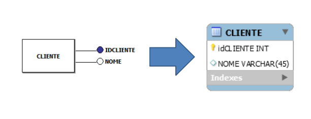
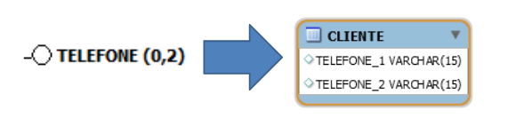
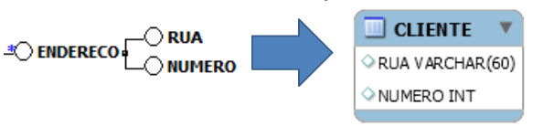
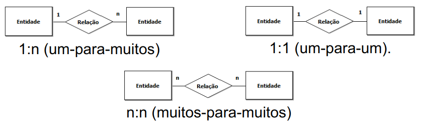
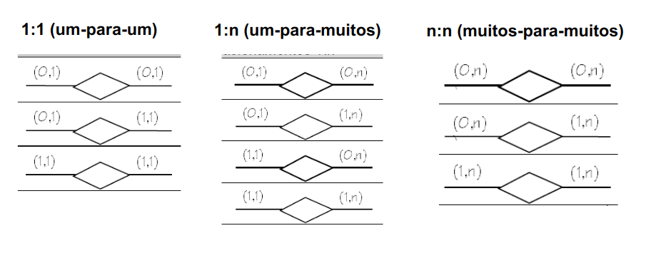
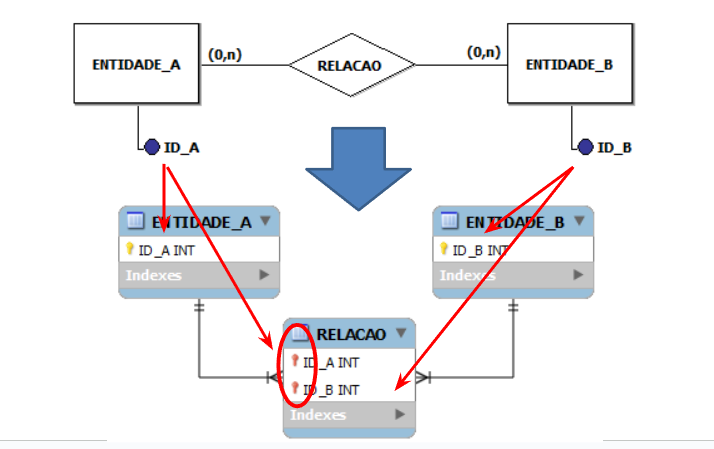

# A Little Knowledge (maybe)

Aqui você encontrá conceitos de relacionamentos, chaves primárias, chaves estrangeiras, cardinalidade e transformações.

## Banco de dados

Um banco de dados é um conjunto organizado de informações inter-relacionadas, projetado para atender às necessidades de uma comunidade de usuários, oferecendo acesso e manipulação eficientes dos dados.

## SGBD

SGBD (Sistema de Gerenciamento de Banco de Dados) é um software que gerencia o armazenamento, organização e acesso a dados. Exemplos incluem MySQL, Oracle Database, Microsoft SQL Server, PostgreSQL e MongoDB.

## Modelagem de Banco de Dados

Modelagem de Banco de Dados é o processo de analisar as informações presentes em um determinado contexto, com o objetivo de construir um modelo que represente e compreenda esse contexto. O propósito fundamental de um modelo de dados é garantir que todos os objetos de dados necessários para a aplicação e para o banco de dados estejam representados com precisão e abrangência.

## Modelagem de Dados

Modelagem de Dados é o processo de descrever os tipos de informações armazenadas em um banco de dados. Para construir essas descrições, usamos linguagens de modelagem de dados, que podem ser gráficas ou textuais.

A técnica mais comum de modelagem é a abordagem Entidade-Relacionamento (ER), desenvolvida por Peter Chen em 1976. Nesse método, usamos um Modelo Entidade-Relacionamento (MER), representado graficamente por um Diagrama Entidade-Relacionamento (DER). A abordagem ER é amplamente usada e serve como base até mesmo para técnicas mais recentes, como a modelagem orientada a objetos.

O maior desafio da modelagem de dados é entender um problema do mundo real e transformá-lo em uma solução viável. Para isso, é essencial que o profissional de informática saiba ouvir o cliente ou usuário, identificando o que é realmente necessário para a implementação. Além disso, é fundamental dominar as técnicas de modelagem para representar o problema de forma conceitual antes de iniciar a implementação.


### Resumo

- Um Banco de Dados consiste em Tabelas.
  
- Uma Tabela é a estrutura interna de um Banco de Dados, composta por Dados.
  
- As Tabelas são compostas por Linhas e Colunas.
  
- Cada Coluna representa uma Categoria de Dados na Tabela, também conhecida como Campo.
  
- Cada Linha, chamada de Registro, contém os dados completos de um objeto representado pela Tabela.

### DER e Notações

No contexto de Diagramas Entidade-Relacionamento (DER), diferentes notações são utilizadas para representar modelos conceituais e físicos de bancos de dados. Aqui estão algumas delas:

- **Notação de Peter Pin-Shan Chen (modelo conceitual):**
  - Desenvolvida por Peter Pin-Shan Chen, esta notação é amplamente usada para representar modelos conceituais. Ela inclui símbolos para entidades, relacionamentos, atributos e cardinalidade.

- **Notação de Carlos Alberto Hauser (modelo conceitual):**
  - Carlos Alberto Hauser desenvolveu uma notação semelhante à de Chen para modelagem conceitual. Ela também inclui símbolos para entidades, relacionamentos e atributos, com ênfase na clareza e na simplicidade.

- **Notação de James Martin (modelo físico):**
  - Utilizada para representar modelos físicos de bancos de dados, a notação de James Martin é mais detalhada e focada em aspectos de implementação. Ela inclui símbolos para tabelas, chaves primárias, chaves estrangeiras e outros elementos físicos do banco de dados.

- **Notação de Charles Willian Bachman (modelo físico):**
  - Desenvolvida por Charles Willian Bachman, esta notação é outra abordagem para representar modelos físicos de bancos de dados. Ela se concentra em aspectos como estruturas de dados, relacionamentos e restrições de integridade.

Cada uma dessas notações tem suas próprias convenções e símbolos específicos, projetados para atender às necessidades de modelagem em diferentes estágios do desenvolvimento de bancos de dados.

## Modelagem Conceitual


### Entidade

Uma entidade representa um conjunto de objetos do mundo real no modelo conceitual.


### Atributo

Um atributo é um espaço reservado para armazenar dados em cada ocorrência de uma entidade ou relacionamento. Cada atributo representa uma informação associada.


### Identificador

Toda entidade deve ter um identificador, que é um conjunto de um ou mais atributos cujos valores diferenciam uma ocorrência da entidade das outras.


### Atributo com Cardinalidade

A cardinalidade de um atributo define quantos valores desse atributo podem estar associados a uma ocorrência da entidade/relacionamento ao qual pertence. É representada por um par de valores, em que o primeiro é a cardinalidade mínima e o segundo é a cardinalidade máxima. Um atributo é opcional quando a cardinalidade mínima é 0 (zero) e/ou multivalorado quando a cardinalidade máxima é N.


### Atributo Composto

Um atributo composto é formado por um atributo base, que dá nome ao atributo, seguido dos atributos que compõem sua estrutura. O número máximo de níveis é 1 (um), ou seja, não é permitido criar um atributo composto por outro atributo composto.


## Modelagem Lógica/Física

O modelo lógico é a representação resultante da conversão de um modelo conceitual para um tipo específico de banco de dados, sendo o nível de abstração visto pelo usuário do sistema de gerenciamento de banco de dados (SGBD).

O modelo físico é a representação resultante da conversão de um modelo lógico para um modelo direcionado a um SGBD específico, ou seja, é uma representação do modelo de acordo com as características do SGBD escolhido.




### Atributo com Identificador

No modelo lógico, o atributo identificador é representado como a Chave Primária da tabela (entidade). Ele é indicado pelo símbolo de uma chave dourada na frente do nome do atributo ou pelo prefixo "PK".


### Atributo com Cardinalidade

Os atributos com cardinalidade, sejam eles opcionais ou multivalorados, são adicionados à entidade de acordo com a quantidade expressa na cardinalidade máxima. Em alguns casos, pode ser necessário criar outra tabela para adicionar esse atributo, especialmente se a cardinalidade máxima for maior que 1 e houver a necessidade de manter a integridade e normalização dos dados.



### Atributo Composto

No modelo conceitual, apenas os atributos que fazem parte da composição aparecem dentro da entidade. O atributo base é usado para nomear a entidade. Em alguns casos, pode ser necessário criar outra tabela para adicionar esse atributo, especialmente se a estrutura do atributo composto for complexa ou se houver a necessidade de manter a integridade e normalização dos dados.



### Tipos de Dados para os Atributos

| Tipo de Dado | Descrição                                           |
|--------------|-----------------------------------------------------|
| **CHAR(n)**      | Campo de texto limitado, sempre preenchido à direita com espaços, com tamanho fixo n. |
| **VARCHAR(n)**   | Campo de texto de tamanho variável, com tamanho máximo n. |
| **INT**          | Inteiro de tamanho normal.                           |
| **FLOAT(p)**     | Número de ponto flutuante pequeno, com precisão p.   |
| **DOUBLE(n, p)** | Número de ponto flutuante de tamanho normal, com precisão n e p. |
| **DECIMAL(n, p)**| Número de ponto flutuante de tamanho normal com tamanho fixo, com precisão n e p. |
| **DATE**         | Tipo de dado para armazenar datas no formato AAAA-MM-DD. |
| **TIME**         | Tipo de dado para armazenar horas no formato HH:NN:SS. |
| **DATETIME**     | Combinação de data e hora separada por espaço, no formato AAAA-MM-DD HH:NN:SS. |
| **TIMESTAMP**    | Combinação de data e hora separada por espaço, no formato AAAA-MM-DD HH:NN:SS. |
| **ENUM('val1', 'val2', ..., 'valN')** | Enumeração de valores, aceitando um valor do tipo texto ou número inteiro. |
| **BLOB**         | Campo para armazenar imagem ou texto muito grande, com tamanho máximo de 4294967295 ou 4GB. |

***Exemplo de uso:***

```sql
CREATE TABLE exemplo (
    char_column CHAR(10),
    varchar_column VARCHAR(255),
    int_column INT,
    float_column FLOAT(5,2),
    double_column DOUBLE(10,4),
    decimal_column DECIMAL(8,2),
    date_column DATE,
    time_column TIME,
    datetime_column DATETIME,
    timestamp_column TIMESTAMP,
    enum_column ENUM('valor1', 'valor2', 'valor3'),
    blob_column BLOB,
    unique_column VARCHAR(50) UNIQUE,
    not_null_column INT NOT NULL,
    default_column INT DEFAULT 0
);
```

### Opções: Integridade de Dados a nível de Atributo

| Modificador    | Descrição                                                                                   |
|----------------|---------------------------------------------------------------------------------------------|
| **NOT NULL**       | Impede a inclusão de valores nulos na coluna, tornando o campo obrigatório.                  |
| **AUTO_INCREMENT** | Gera automaticamente um número incremental para cada novo registro na coluna.                 |
| **UNIQUE**         | Garante a unicidade dos valores em uma coluna, não permitindo a duplicação de valores.       |
| **DEFAULT(valor)** | Define um valor padrão que será assumido na inserção de um novo registro, se não for fornecido um valor explícito para a coluna. |

***Exemplo de uso:***

```sql
CREATE TABLE exemplo (
    id INT AUTO_INCREMENT PRIMARY KEY,
    nome VARCHAR(50) NOT NULL,
    email VARCHAR(100) UNIQUE,
    status ENUM('ativo', 'inativo') DEFAULT 'ativo'
);
```

Neste exemplo, a coluna `id` terá valores incrementais automaticamente, a coluna `nome` é obrigatória e não pode ser nula, a coluna `email` deve ser única em toda a tabela e a coluna `status` terá o valor padrão `'ativo'` se nenhum valor for fornecido durante a inserção de um novo registro.

## Relacionamento


### Tipos de Relação


Além de especificar os objetos sobre os quais se deseja manter informações, é importante também definir as associações entre esses objetos. Existem diferentes tipos de relações que podem ocorrer em um modelo de banco de dados:

- **Um para Um (1:1)**: Cada ocorrência de uma entidade está associada a no máximo uma ocorrência de outra entidade, e vice-versa.

- **Um para Muitos (1:N)**: Cada ocorrência de uma entidade está associada a uma ou mais ocorrências de outra entidade, mas cada ocorrência desta última está associada a no máximo uma ocorrência da primeira.

- **Muitos para Muitos (N:M)**: Cada ocorrência de uma entidade pode estar associada a várias ocorrências de outra entidade e vice-versa.

Esses tipos de relações ajudam a definir como os dados estão interconectados no banco de dados e são fundamentais para o projeto e a estruturação adequada do sistema de banco de dados.

### Cardinalidade

Ao projetar um banco de dados, uma propriedade crucial de um relacionamento é quantas ocorrências de uma entidade podem estar associadas a uma determinada ocorrência por meio desse relacionamento. Essa propriedade é conhecida como cardinalidade de uma entidade em um relacionamento.
	
#### Cardinalidade Mínima

A cardinalidade mínima refere-se ao número mínimo de ocorrências de uma entidade que podem estar associadas a uma ocorrência de outra entidade por meio de um relacionamento.

Podemos classificar os relacionamentos da seguinte forma:


#### Cardinalidade Máxima

A cardinalidade máxima é usada para classificar relacionamentos binários, onde as ocorrências envolvem duas entidades.

Podemos classificar os relacionamentos da seguinte forma:



### Cardinalidade Representação


### Sentido de Leitura


> "Um modelo lógico é uma descrição de um banco de dados no nível de abstração visto pelo usuário do sistema de gerenciamento de banco de dados."

## Conceito de Chave

O conceito fundamental para estabelecer relações entre linhas de tabelas em um banco de dados relacional é o da chave.

- **Chave primária Simples / Compostas :** Pode ser uma única coluna ou a combinação de duas ou mais colunas, e é responsável por identificar exclusivamente cada linha na tabela. É a origem do identificador único para cada registro.

    

- **Chave estrangeira:** Representa uma coluna ou conjunto de colunas em uma tabela que referenciam a chave primária de outra tabela. Estabelece relacionamentos entre tabelas e garante a integridade referencial no banco de dados. É a origem do relacionamento entre as tabelas.

    

- **Chave alternativa:** Em certos casos, os valores de uma coluna não podem ser repetidos, mesmo que essa coluna não faça parte da chave primária. Essas colunas são conhecidas como chaves alternativas.

### Transformação

A transformação ocorre em função da cardinalidade máxima usada para classificar relacionamentos binários.



O resultado da transformação do relacionamento na modelagem lógica pode ser dividido em:

- **Tabela Própria:** O relacionamento se torna uma nova entidade (tabela), recebendo como identificador as chaves primárias das duas tabelas que participam do relacionamento.

- **Adição de Coluna:** A entidade com maior cardinalidade máxima recebe como uma coluna adicional o identificador da entidade com menor cardinalidade máxima.

- **Fusão de Tabelas:** As duas entidades se fundem em uma única tabela e o relacionamento é representado diretamente nela.

#### Relacionamentos 1:1 (Conceitual)


#### Relacionamentos 1:n (Conceitual)


#### Relacionamentos n:n (Conceitual)


### Chaves Estrangeiras

```sql
CREATE TABLE nome_da_tabela (
	nome_campo tipo_campo ,
	
	FOREIGN KEY (nome_campo)
	REFERENCES nome_tabela_relacionada (nome_campo_relacionado)
);
```

***Exemplo:***

```sql
CREATE TABLE funcionario (
	departamento int,

	FOREIGN KEY (departamento) REFERENCES departamento (codigo)
);
```

### Transformação - Relacionamentos 1:1


#### Fusão de Tabelas


***Exemplo:***

```sql
CREATE TABLE ENTIDADE_AB (
	ID_A INT NOT NULL,
	ID_B INT NOT NULL,
	PRIMARY KEY (ID_A, ID_B),
);
```

### Transformação - Relacionamento 1:n


#### Adição de Colunas


***Exemplo:***

```sql
CREATE TABLE ENTIDADE_A (
	ID_A INT NOT NULL,
	PRIMARY KEY (ID_A),
);

CREATE TABLE ENTIDADE_B (
	ID_B INT NOT NULL,
	ID_A INT,
	PRIMARY KEY (ID_B),
	FOREIGN KEY (ID_A) REFERENCES ENTIDADE_A (ID_A)
);
```

### Transformação - Relacionamento n:n


#### Tabela Pŕopria



***Exemplo:***

```sql
CREATE TABLE ENTIDADE_A (
	ID_A INT NOT NULL,
	PRIMARY KEY (ID_A),
);

CREATE TABLE ENTIDADE_B (
	ID_B INT NOT NULL,
	PRIMARY KEY (ID_B),
);

CREATE TABLE RELACAO (
	ID_A INT NOT NULL,
	ID_B INT NOT NULL,
	PRIMARY KEY (ID_A, ID_B),
	FOREIGN KEY (ID_A) REFERENCES ENTIDADE_A (ID_A),
	FOREIGN KEY (ID_B) REFERENCES ENTIDADE_B (ID_B)
);
```