# A Little Knowledge (maybe)

Here you will find concepts of relationships, primary keys, foreign keys, cardinality, and transformations.

## Database

A database is an organized collection of interrelated information designed to meet the needs of a community of users, offering efficient access and manipulation of data.

## Database Management System (DBMS)

A Database Management System (DBMS) is software that manages the storage, organization, and access to data. Examples include MySQL, Oracle Database, Microsoft SQL Server, PostgreSQL, and MongoDB.

## Database Modeling

Database modeling is the process of analyzing information within a specific context with the aim of constructing a model that represents and comprehends this context. The fundamental purpose of a data model is to ensure that all necessary data objects for the application and for the database are accurately and comprehensively represented.

## Data Modeling

Data modeling is the process of describing the types of information stored in a database. To build these descriptions, we use data modeling languages, which can be graphical or textual.

The most common modeling technique is the Entity-Relationship (ER) approach, developed by Peter Chen in 1976. In this method, we use an Entity-Relationship Model (ERM), graphically represented by an Entity-Relationship Diagram (ERD). The ER approach is widely used and serves as a basis even for more recent techniques, such as object-oriented modeling.

The biggest challenge of data modeling is understanding a real-world problem and transforming it into a viable solution. For this, it is essential that the IT professional knows how to listen to the client or user, identifying what is really needed for implementation. Additionally, it is fundamental to master modeling techniques to represent the problem conceptually before starting implementation.

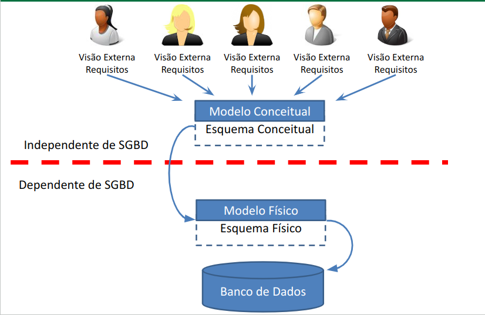

### Summary

- A Database consists of Tables.
  
- A Table is the internal structure of a Database, composed of Data.

- Tables are composed of Rows and Columns.

- Each Column represents a Data Category in the Table, also known as a Field.

- Each Row, called a Record, contains the complete data of an object represented by the Table.

### ERD and Notations

In the context of Entity-Relationship Diagrams (ERDs), different notations are used to represent conceptual and physical models of databases. Here are some of them:

- **Peter Pin-Shan Chen Notation (conceptual model):**
  - Developed by Peter Pin-Shan Chen, this notation is widely used to represent conceptual models. It includes symbols for entities, relationships, attributes, and cardinality.

- **Carlos Alberto Hauser Notation (conceptual model):**
  - Carlos Alberto Hauser developed a notation similar to Chen's for conceptual modeling. It also includes symbols for entities, relationships, and attributes, with an emphasis on clarity and simplicity.

- **James Martin Notation (physical model):**
  - Used to represent physical models of databases, James Martin's notation is more detailed and focused on implementation aspects. It includes symbols for tables, primary keys, foreign keys, and other physical elements of the database.

- **Charles Willian Bachman Notation (physical model):**
  - Developed by Charles Willian Bachman, this notation is another approach to represent physical models of databases. It focuses on aspects such as data structures, relationships, and integrity constraints.

Each of these notations has its own conventions and specific symbols, designed to meet modeling needs at different stages of database development.

## Conceptual Modeling

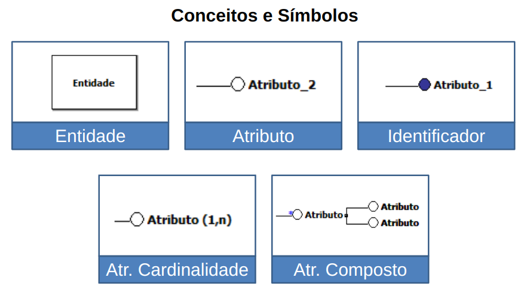

### Entity

An entity represents a set of real-world objects in the conceptual model.


### Attribute

An attribute is a placeholder for storing data in each occurrence of an entity or relationship. Each attribute represents an associated piece of information.


### Identifier

Every entity must have an identifier, which is a set of one or more attributes whose values differentiate one occurrence of the entity from others.

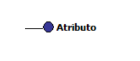

### Attribute with Cardinality

The cardinality of an attribute defines how many values of that attribute can be associated with an occurrence of the entity/relationship to which it belongs. It is represented by a pair of values, where the first is the minimum cardinality and the second is the maximum cardinality. An attribute is optional when the minimum cardinality is 0 (zero) and/or multivalued when the maximum cardinality is N.

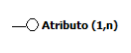

### Composite Attribute

A composite attribute is formed by a base attribute, which names the attribute, followed by the attributes that make up its structure. The maximum number of levels is 1 (one), meaning it is not allowed to create a composite attribute composed of another composite attribute.

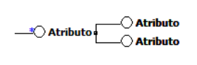

## Logical/Physical Modeling

The logical model is the representation resulting from the conversion of a conceptual model to a specific type of database, being the abstraction level seen by the database management system (DBMS) user.

The physical model is the representation resulting from the conversion of a logical model to a model directed at a specific DBMS, meaning it is a representation of the model according to the characteristics of the chosen DBMS.

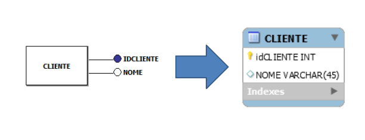

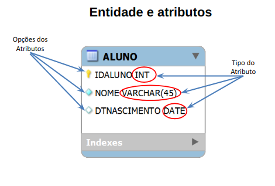

### Attribute with Identifier

In the logical model, the identifier attribute is represented as the Primary Key of the table (entity). It is indicated by the symbol of a golden key in front of the attribute name or by the prefix "PK".

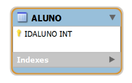

### Attribute with Cardinality

Attributes with cardinality, whether optional or multivalued, are added to the entity according to the quantity expressed in the maximum cardinality. In some cases, it may be necessary to create another table to add this attribute, especially if the maximum cardinality is greater than 1 and there is a need to maintain data integrity and normalization.

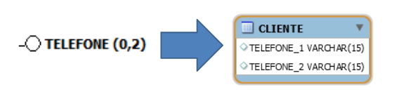

### Composite Attribute

In the conceptual model, only the attributes that are part of the composition appear within the entity. The base attribute is used to name the entity. In some cases, it may be necessary to create another table to add this attribute, especially if the structure of the composite attribute is complex or if there is a need to maintain data integrity and normalization.

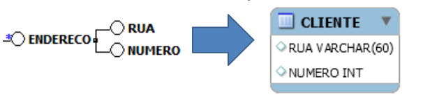

### Data Types for Attributes

| Data Type       | Description                                                  |
|-----------------|--------------------------------------------------------------|
| **CHAR(n)**         | Limited text field, always right-padded with spaces, fixed size n. |
| **VARCHAR(n)**      | Variable-length text field, maximum size n.                  |
| **INT**             | Normal-sized integer.                                         |
| **FLOAT(p)**        | Small floating-point number, precision p.                     |
| **DOUBLE(n, p)**    | Normal-sized floating-point number, precision n and p.        |
| **DECIMAL(n, p)**   | Fixed-size floating-point number, precision n and p.          |
| **DATE**            | Data type for storing dates in the format YYYY-MM-DD.         |
| **TIME**            | Data type for storing time in the format HH:MM:SS.            |
| **DATETIME**        | Combination of date and time separated by a space, in the format YYYY-MM-DD HH:MM:SS. |
| **TIMESTAMP**       | Combination of date and time separated by a space, in the format YYYY-MM-DD HH:MM:SS. |
| **ENUM('val1', 'val2', ..., 'valN')** | Enumeration of values, accepting a text or integer value.   |
| **BLOB**            | Field for storing large image or text, with maximum size of 4294967295 or 4GB. |

***Usage Example:***

```sql
CREATE TABLE example (
    char_column CHAR(10),
    varchar_column VARCHAR(255),
    int_column INT,
    float_column FLOAT(5,2),
    double_column DOUBLE(10,4),
    decimal_column DECIMAL(8,2),
    date_column DATE,
    time_column TIME,
    datetime_column DATETIME,
    timestamp_column TIMESTAMP,
    enum_column ENUM('value1', 'value2', 'value3'),
    blob_column BLOB,
    unique_column VARCHAR(50) UNIQUE,
    not_null_column INT NOT NULL,
    default_column INT DEFAULT 0
);
```

### Options: Attribute-Level Data Integrity

| Modifier       | Description                                                                                  |
|----------------|----------------------------------------------------------------------------------------------|
| **NOT NULL**       | Prevents the inclusion of null values in the column, making the field mandatory.             |
| **AUTO_INCREMENT** | Automatically generates an incremental number for each new record in the column.             |
| **UNIQUE**         | Ensures the uniqueness of values in a column, disallowing duplication of values.             |
| **DEFAULT(value)** | Defines a default value that will be assumed upon insertion of a new record if no explicit value is provided for the column. |

***Usage Example:***

```sql
CREATE TABLE example (
    id INT AUTO_INCREMENT PRIMARY KEY,
    name VARCHAR(50) NOT NULL,
    email VARCHAR(100) UNIQUE,
    status ENUM('active', 'inactive') DEFAULT 'active'
);
```

In this example, the `id` column will have automatically incremented values, the `name` column is mandatory and cannot be null, the `email` column must be unique throughout the table, and the `status` column will default to `'active'` if no value is provided during the insertion of a new record.

## Relationship

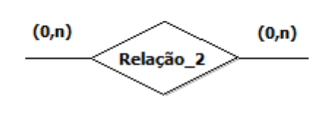

### Relationship Types

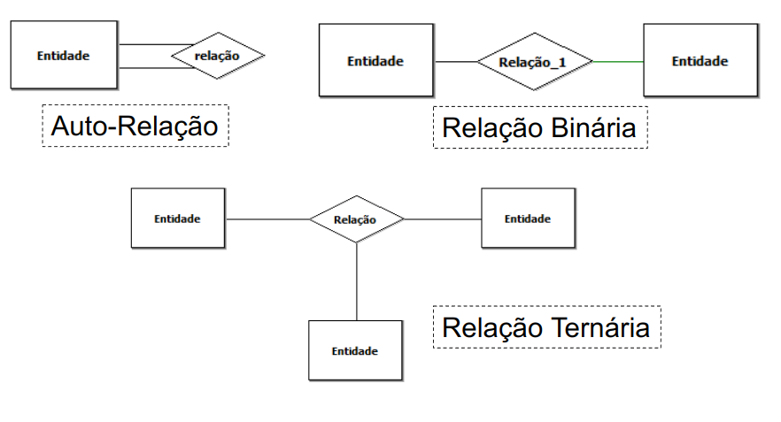

In addition to specifying the objects about which you want to maintain information, it's also important to define the associations between these objects. There are different types of relationships that can occur in a database model:

- **One-to-One (1:1)**: Each occurrence of one entity is associated with at most one occurrence of another entity, and vice versa.

- **One-to-Many (1:N)**: Each occurrence of one entity is associated with one or more occurrences of another entity, but each occurrence of the latter is associated with at most one occurrence of the former.

- **Many-to-Many (N:M)**: Each occurrence of one entity can be associated with several occurrences of another entity, and vice versa.

These types of relationships help define how data is interconnected in the database and are fundamental to the proper design and structuring of the database system.

### Cardinality

When designing a database, a crucial property of a relationship is how many occurrences of one entity can be associated with a given occurrence of another entity through that relationship. This property is known as the cardinality of an entity in a relationship.
	
#### Minimum Cardinality

Minimum cardinality refers to the minimum number of occurrences of one entity that can be associated with an occurrence of another entity through a relationship.

We can classify relationships as follows:

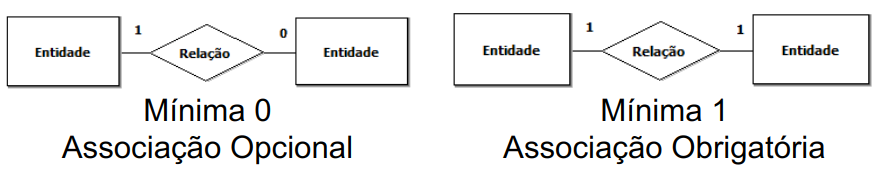

#### Maximum Cardinality

Maximum cardinality is used to classify binary relationships, where the occurrences involve two entities.

We can classify relationships as follows:

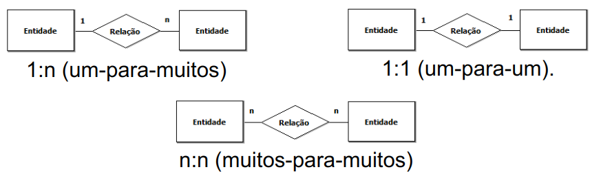

### Cardinality Representation

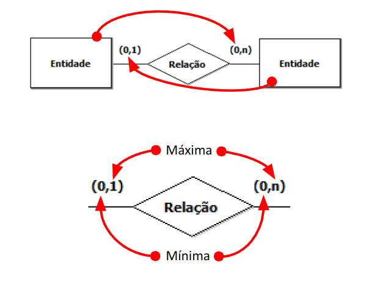

### Reading Direction

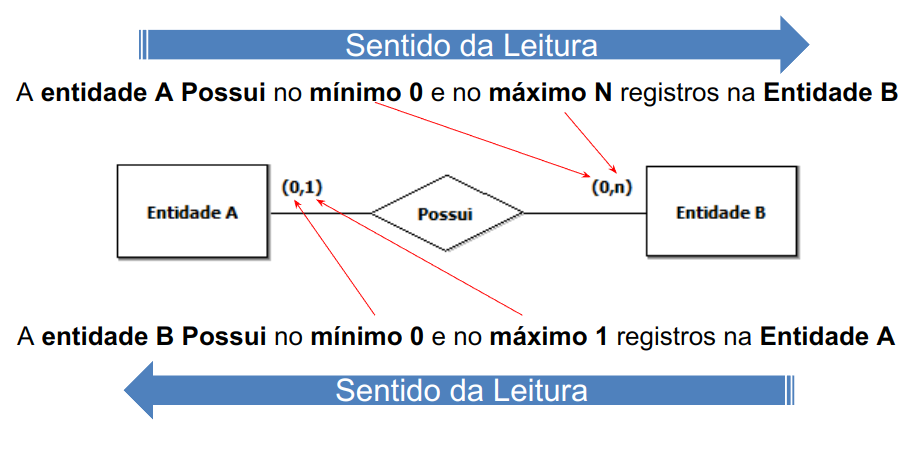

> "A logical model is a description of a database at the abstraction level seen by the user of the database management system."

## Key Concept

The fundamental concept for establishing relationships between rows of tables in a relational database is that of the key.

- **Simple/Composite Primary Key:** It can be a single column or the combination of two or more columns, and it is responsible for uniquely identifying each row in the table. It's the origin of the unique identifier for each record.

    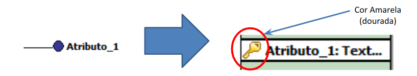

- **Foreign Key:** Represents a column or set of columns in a table that references the primary key of another table. It establishes relationships between tables and ensures referential integrity in the database. It's the origin of the relationship between tables.

    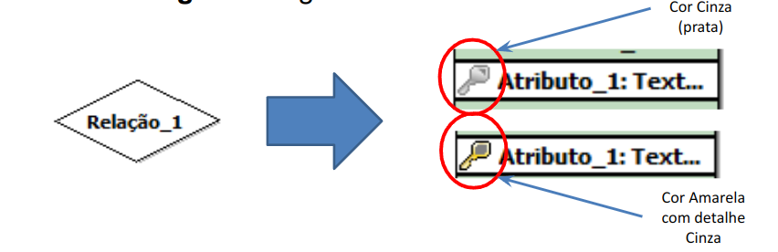

- **Alternate Key:** In certain cases, the values of a column cannot be repeated, even if that column is not part of the primary key. These columns are known as alternate keys.

### Transformation

Transformation occurs based on the maximum cardinality used to classify binary relationships.

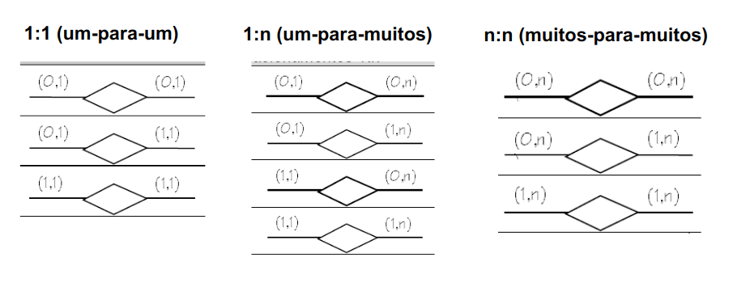

The result of the transformation of the relationship in the logical model can be divided into:

- **Own Table:** The relationship becomes a new entity (table), receiving as its identifier the primary keys of the two tables involved in the relationship.

- **Column Addition:** The entity with the higher maximum cardinality receives, as an additional column, the identifier of the entity with the lower maximum cardinality.

- **Table Merge:** The two entities are merged into a single table, and the relationship is directly represented in it.

#### One-to-One Relationships (Conceptual)

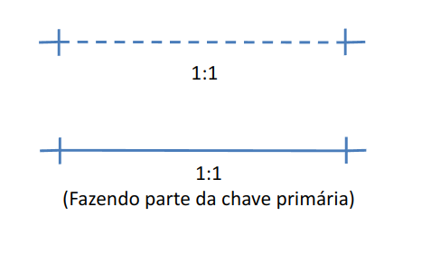

#### One-to-Many Relationships (Conceptual)

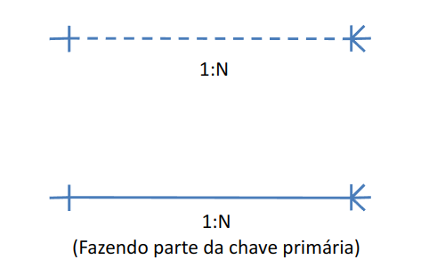

#### Many-to-Many Relationships (Conceptual)

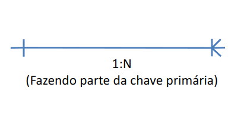

### Foreign Keys

```sql
CREATE TABLE table_name (
    column_name data_type ,
    
    FOREIGN KEY (column_name)
    REFERENCES referenced_table_name (referenced_column_name)
);
```

***Example:***

```sql
CREATE TABLE employee (
    department int,

    FOREIGN KEY (department) REFERENCES department (code)
);
```

### Transformation - One-to-One Relationships

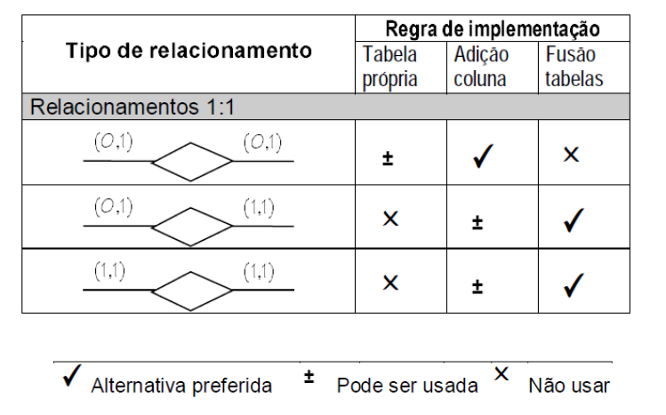

#### Table Merge

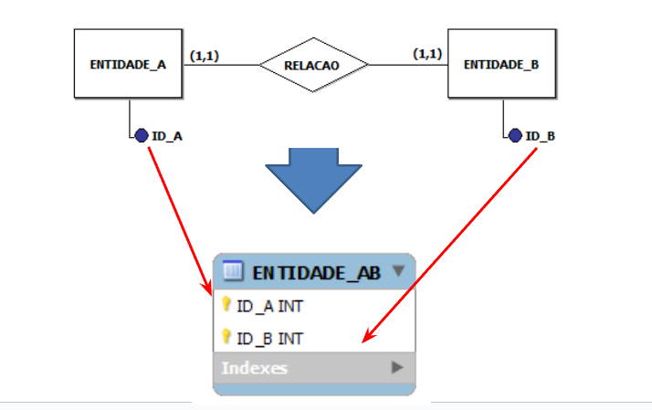

***Example:***

```sql
CREATE TABLE ENTITY_AB (
    ID_A INT NOT NULL,
    ID_B INT NOT NULL,
    PRIMARY KEY (ID_A, ID_B),
);
```

### Transformation - One-to-Many Relationship

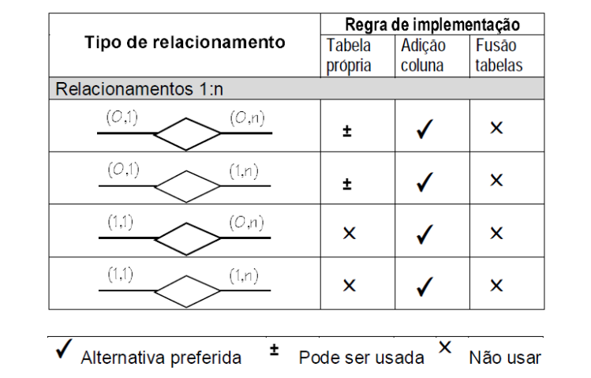

#### Column Addition

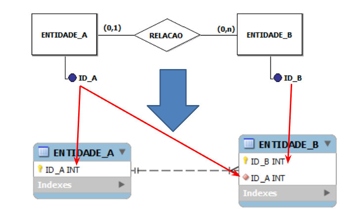

***Example:***

```sql
CREATE TABLE ENTITY_A (
    ID_A INT NOT NULL,
    PRIMARY KEY (ID_A),
);

CREATE TABLE ENTITY_B (
    ID_B INT NOT NULL,
    ID_A INT,
    PRIMARY KEY (ID_B),
    FOREIGN KEY (ID_A) REFERENCES ENTITY_A (ID_A)
);
```

### Transformation - Many-to-Many Relationship

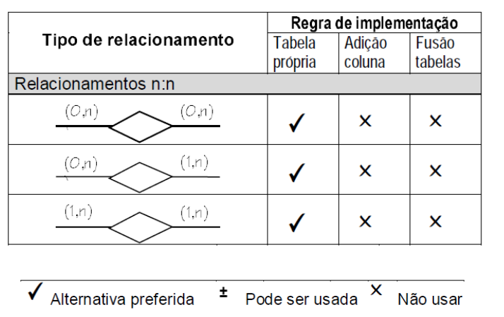

#### Own Table

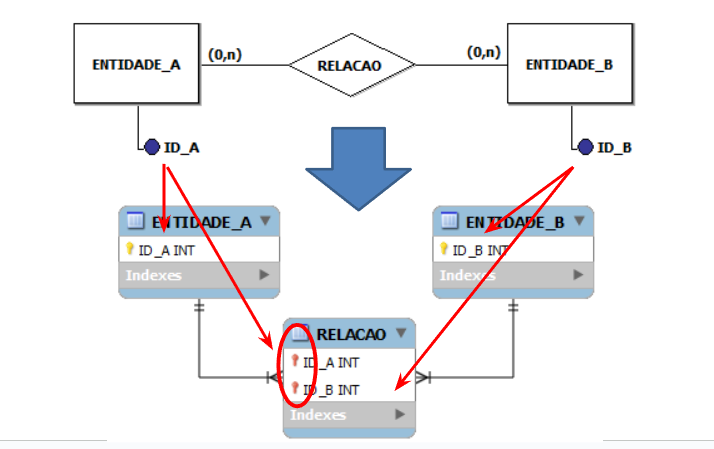

***Example:***

```sql
CREATE TABLE ENTITY_A (
    ID_A INT NOT NULL,
    PRIMARY KEY (ID_A),
);

CREATE TABLE ENTITY_B (
    ID_B INT NOT NULL,
    PRIMARY KEY (ID_B),
);

CREATE TABLE RELATION (
    ID_A INT NOT NULL,
    ID_B INT NOT NULL,
    PRIMARY KEY (ID_A, ID_B),
    FOREIGN KEY (ID_A) REFERENCES ENTITY_A (ID_A),
    FOREIGN KEY (ID_B) REFERENCES ENTITY_B (ID_B)
);
```