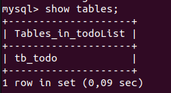
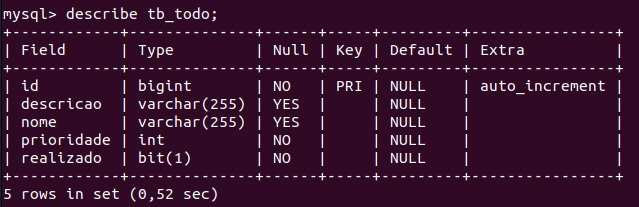

# Data Definition Language (DDL)

The Data Definition Language (DDL) includes commands to define, alter, and remove the structure of database objects such as tables, indexes, views, and constraints. These commands allow users to define the structure of the data to be stored in the database.

Examples of DDL commands in SQL include:

- **CREATE**: To create new database objects such as tables, indexes, and views.
- **ALTER**: To modify the structure of existing objects in the database, such as adding, modifying, or deleting columns from a table.
- **DROP**: To remove database objects such as tables, indexes, and views.

## Database

### Creating a Database:

```sql
CREATE DATABASE database_name;
```

### Selecting the Database for Table Creation

```sql
USE database_name;
```


### Showing Already Created Tables

```sql
SHOW TABLES;
```



### Showing the Structure of Tables

```sql
DESCRIBE table_name;
```



## Tables

### Creating Tables - Fields

```sql
CREATE TABLE table_name (
    field_name1 field_type field_options,
    field_name2 field_type field_options,
    field_name_n field_type field_options
);
```

## Domain or Data Type - MySQL

Here is the table with data types and their descriptions:

| Data Type    | Description                                             |
|--------------|---------------------------------------------------------|
| **CHAR(n)**      | Fixed-length text field, always right-padded with spaces, with fixed size n. |
| **VARCHAR(n)**   | Variable-length text field, with maximum size n. |
| **INT**          | Normal-sized integer.                           |
| **FLOAT(p)**     | Small floating-point number, with precision p.   |
| **DOUBLE(n, p)** | Normal-sized floating-point number, with precision n and p. |
| **DECIMAL(n, p)**| Fixed-size normal-sized floating-point number, with precision n and p. |
| **DATE**         | Data type for storing dates in the format YYYY-MM-DD. |
| **TIME**         | Data type for storing time in the format HH:MM:SS. |
| **DATETIME**     | Combination of date and time in the format YYYY-MM-DD HH:MM:SS. |
| **TIMESTAMP**    | Combination of date and time in the format YYYY-MM-DD HH:MM:SS. |
| **ENUM('val1', 'val2', ..., 'valN')** | Enumeration of values, accepting a value of text or integer type. |
| **BLOB**         | Field for storing large images or text, with maximum size of 4294967295 or 4GB. |

## Field-Level Data Integrity

### **NOT NULL:** Disallows inclusion of null values, making the field mandatory.

```sql
CREATE TABLE table_name (
    field_name field_type NOT NULL
);
```

***Example:***

```sql
CREATE TABLE student (
    name varchar(100) NOT NULL
);
```

### **AUTO_INCREMENT:** Generates an incremental number for each new record.

```sql
CREATE TABLE table_name (
    field_name field_type AUTO_INCREMENT
);
```

***Example:***

```sql
CREATE TABLE student (
    code int AUTO_INCREMENT
);
```

### **UNSIGNED:** Used to allow only positive values.

```sql
CREATE TABLE table_name (
    field_name field_type UNSIGNED
);
```

***Example:***

```sql
CREATE TABLE person (
    age int UNSIGNED
);
```

### **UNIQUE:** Ensures the uniqueness of a field value in the table.
    
```sql
CREATE TABLE table_name (
    field_name field_type UNIQUE
);
```

***Example:***

```sql
CREATE TABLE person (
    cpf char(11) UNIQUE
);
```

### **DEFAULT(value):** Values assumed on insertion if no explicit indication is given.

```sql
CREATE TABLE table_name (
    field_name field_type DEFAULT (value)
);
```

***Example:***

```sql
CREATE TABLE student (
    registration_date TIMESTAMP DEFAULT CURRENT_TIMESTAMP
);
```

### **ZEROFILL:** Fills empty spaces of the column with zero.

```sql
CREATE TABLE table_name (
    field_name field_type ZEROFILL
);
```

***Example:***

```sql
CREATE TABLE account(
    fee int ZEROFILL
);
```

## Primary Keys

We have two types of primary keys:

**Simple:** Formed by only one field of the table.

**Composite:** Composed of two or more fields of the table.

### Simple Primary Keys

```sql
CREATE TABLE table_name (
    field_name field_type PRIMARY KEY
);
```

```sql
CREATE TABLE table_name (
    field_name field_type ,
    
    PRIMARY KEY (field_name)
);
```

***Example:***

```sql
CREATE TABLE student (
    code int PRIMARY KEY
);
```

```sql
CREATE TABLE student (
    code int,
    
    PRIMARY KEY (code)
);
```

### Composite Primary Keys

```sql
CREATE TABLE table_name (
    field_name field_type ,
    
    PRIMARY KEY (field_name)
);
```

***Example:***

```sql
CREATE TABLE order_items (
    order_code int,
    product_code int,
    
    PRIMARY KEY (order_code, product_code)
);
```

### Foreign Keys

```sql
CREATE TABLE table_name (
    field_name field_type ,
    
    FOREIGN KEY (field_name)
    REFERENCES related_table_name (related_field_name)
);
```

***Example:***

```sql
CREATE TABLE employee (
    department int,

    FOREIGN KEY (department) REFERENCES department (code)
);
```

## Alteration on Already Created Tables

### Adding a New Field to a Table

```sql
ALTER TABLE table_name 
ADD COLUMN field_name attribute_type;
```

***Example:***

```sql
ALTER TABLE student 
ADD COLUMN address varchar(75) not null;
```

### Removing a Field from a Table 

> **Attention: Removing this field will delete all data contained in this field, for all records.**

```sql
ALTER TABLE table_name 
DROP COLUMN field_name;
```
***Example:***

```sql
ALTER TABLE student 
DROP COLUMN address;
```

If the field is used in an index or key, removal will not be permitted.

### Adding a Primary Key to an Existing Field

```sql
ALTER TABLE table_name 
ADD PRIMARY KEY (field_name);
```

***Example:***

```sql
ALTER TABLE student 
ADD PRIMARY KEY (student_id);
```

Adding a Foreign Key to an Existing Field.

```sql
ALTER TABLE table_name 
ADD FOREIGN KEY (field_name) REFERENCES related_table (related_field_name);
```

***Example:***

```sql
ALTER TABLE employee
ADD FOREIGN KEY (department_code) REFERENCES department (code);
```

## Removal of Already Created Tables

> **Attention: Removing a table will delete all contained data!**

```sql
DROP TABLE table_name;
```

***Example:***

```sql
DROP TABLE student;
```

If the table is used in a relationship, removal will not be permitted!
