# Data Manipulation Language (DML)

The Data Manipulation Language (DML) includes commands to insert, delete, update, and query data stored in the tables of a database. These commands allow users to perform operations on the data, such as adding new records, modifying existing records, deleting records, or querying specific information.

Examples of DML commands in SQL include:

- **INSERT**: To add new records to a table.
- **DELETE**: To remove records from a table.
- **UPDATE**: To modify the data of existing records in a table.
- **SELECT**: To query and retrieve specific data from one or more tables.

## Inserting Records

```sql
INSERT INTO table_name (field_name_a, field_name_b, ..., field_name_n) VALUES (value_field_a, value_field_b, ..., value_field_n);
```

***Example:***

```sql
CREATE TABLE CLIENT (
	IDCLIENT INT PRIMARY KEY AUTO_INCREMENT,
	NAME VARCHAR(10),
	GENDER CHAR(1),
	AGE INT,
	CITY VARCHAR(20)
);

INSERT INTO CLIENT (NAME, AGE) VALUES ('JOHN', 12);
```

**Attention:**

Any value that can go into a column of type **VARCHAR**, **CHAR**, **DATE**, **TIME**, **DATETIME**, **TIMESTAMP**, or **BLOB** must be enclosed in single quotes.

The values must be listed exactly in the same order as the column names.

It's possible to leave some columns out of the INSERT, as long as they are not mandatory.

## Deleting Records

The **DELETE** command is used to delete data from the table. This command uses the **WHERE** clause to restrict the records that will be deleted.

```sql
DELETE FROM table_name WHERE condition;
```

***Example:***

```sql
DELETE FROM CLIENT WHERE IDCLIENT = 1;
```

## WHERE

Operators for the WHERE clause:


| Operator | Description          |
|----------|--------------------|
| **=**        | Equal              |
| **<>**       | Not equal          |
| **>**        | Greater than       |
| **<**        | Less than          |
| **>=**       | Greater than or equal to    |
| **<=**       | Less than or equal to    |
| **IN**       | In a list          |
| **LIKE**     | Contains       |
| **NOT**      | Negation            |
| **IS NULL**  | Only null values |
| **BETWEEN**  | Between values      |

## Updating Data

The **UPDATE** command is used to update one or more columns, assigning new values. This command uses the **WHERE** clause to restrict the records that will be changed.

```sql
UPDATE table_name SET field_name = value WHERE condition;
```

***Example:***

```sql
UPDATE CLIENT SET GENDER = 'F' WHERE IDCLIENT = 7 AND GENDER IS NULL;
```

To update more than one column, use a comma.

```sql
UPDATE table_name SET 
	field_name_1 = value_1,
	field_name_2 = value_2,
WHERE condition;
```

***Example:***

```sql
UPDATE CLIENT SET GENDER = 'F', AGE = 21 
WHERE IDCLIENT = 7;
```

## Querying Data

```sql
SELECT * FROM table_name
```

***Example:***

```sql
SELECT * FROM CLIENT
```

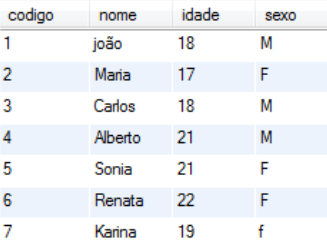

### WHERE

The **WHERE** clause tells SQL to search for something specific. It limits the results, displaying only the rows that match the established condition.

```sql
SELECT * FROM table_name WHERE field_name operator value
```

***Example:***

```sql
SELECT * FROM CLIENT WHERE CODE = 1
```

### OR and AND Operators

You can use the logical operators OR and AND to combine more than one condition in the WHERE clause.

```sql
SELECT * FROM CLIENT
WHERE
	(AGE >= 18 AND GENDER = 'M') OR
	(AGE >= 21 AND GENDER = 'F')
```

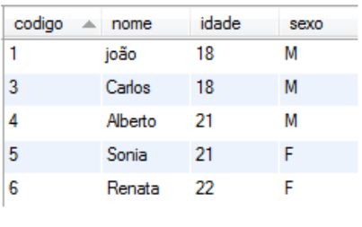

### Group By

The **GROUP BY** clause is used to group the results in a SQL query.

```sql
SELECT 
    EMPLOYEE,
    NAME,
    DEPARTMENT 
FROM;
```

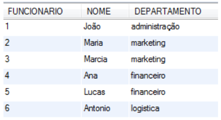

```sql
SELECT
	COUNT(EMPLOYEE),
	DEPARTMENT
FROM
	EMPLOYEE
GROUP BY 
	DEPARTMENT;
```

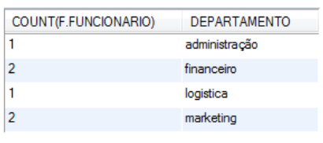

### Group By and its Functions

| Function        | Description                                           |
|---------------|-----------------------------------------------------|
| **COUNT**         | Returns the number of records with different non-NULL values |
| **AVG**           | Returns the average value                               |
| **MIN**           | Returns the minimum value                               |
| **MAX**           | Returns the maximum value                               |
| **SUM**           | Returns the sum of values                               |
| **GROUP_CONCAT**  | Returns the grouped, concatenated values               |

### Ordering

```sql
SELECT * FROM CLIENT ORDER BY NAME
```

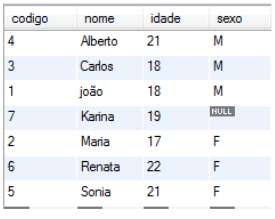

#### ASC - Ascending

```sql
SELECT * FROM CLIENT ORDER BY AGE ASC
```

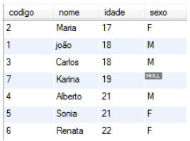

#### DESC - Descending

```sql
SELECT * FROM CLIENT ORDER BY AGE DESC
```

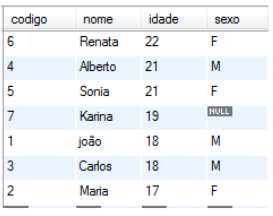

#### Multiple Columns

```sql
SELECT * FROM CLIENT ORDER BY AGE DESC, GENDER, NAME
```

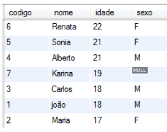

#### LIMIT - quantity

```sql
SELECT * FROM CLIENT ORDER BY NAME LIMIT 5
```

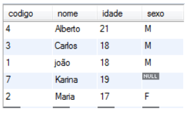

#### LIMIT - start, quantity

```sql
SELECT * FROM CLIENT ORDER BY NAME LIMIT 4,3
```

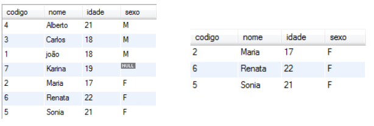

## Aliases for Tables and Fields

We can create aliases for table names to make references easier. The same can happen with column names.

To do this, we must use the reserved word "AS" immediately after the table name or column name. Table aliases are also called correlation names.

***Example:***

```sql
SELECT NAME AS NM, AGE FROM CLIENT AS CL;
```

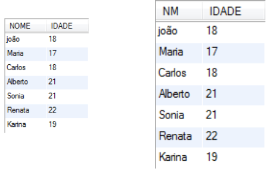