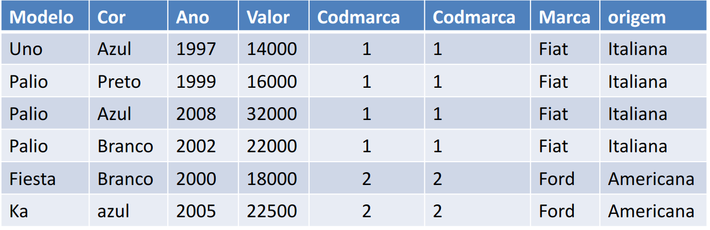

# Linguagem de Consulta de Dados (DQL)

A Linguagem de Consulta de Dados (DQL) inclui comandos para recuperar dados de um banco de dados. O principal objetivo da DQL é permitir que os usuários realizem consultas para recuperar informações específicas armazenadas no banco de dados.

Exemplo de comando DQL em SQL:

- **SELECT**: Para consultar e recuperar dados específicos de uma ou mais tabelas, com base em critérios definidos pelo usuário.

## Produto Cartesiano

O produto cartesiano é um conceito fundamental na matemática que surge da combinação de elementos de dois conjuntos distintos. Ao tomar dois conjuntos, denotados como X e Y, o produto cartesiano desses conjuntos é o conjunto de todos os pares ordenados, onde o primeiro elemento pertence a X e o segundo pertence a Y.

**Exemplo:**

Seja o conjunto X = {A, B, C, D} e o conjunto Y = {1, 2, 3}.

O produto cartesiano de X e Y, representado como X * Y, seria:

```
X * Y = {
    (A, 1), (A, 2), (A, 3),
    (B, 1), (B, 2), (B, 3),
    (C, 1), (C, 2), (C, 3),
    (D, 1), (D, 2), (D, 3),
}
```

Essencialmente, cada elemento de X é combinado com cada elemento de Y para formar todos os possíveis pares ordenados.


### Exemplo em SQL

No contexto de bancos de dados, o produto cartesiano é frequentemente usado em consultas SQL para combinar todas as linhas de duas tabelas.

```sql
SELECT * FROM veiculo, marca;
```

Neste exemplo, a consulta SQL retorna todas as combinações possíveis de linhas das tabelas "veiculo" e "marca".

- **Colunas resultantes:** 5 colunas da tabela "veiculo" + 3 colunas da tabela "marca" = 8 colunas no total.
- **Linhas resultantes:** Como há 6 linhas na tabela "veiculo" e 2 linhas na tabela "marca", o produto cartesiano resulta em 12 linhas.


## Consultas Joins

Em bancos de dados relacionais, a relação entre tabelas é fundamental para a existência e a utilidade dos dados. Por isso, muitas vezes é necessário acessar informações através da junção de tabelas.

Os relacionamentos entre tabelas são estabelecidos através de chaves estrangeiras (FK).

## Junções vs Produto Cartesiano

Embora para muitos, junções e produto cartesiano possam parecer a mesma coisa, existe uma distinção importante entre eles. O produto cartesiano é caracterizado pela combinação de duas ou mais tabelas, trazendo todas as possíveis combinações entre elas. Isso inclui informações verdadeiras e falsas.

Por outro lado, as junções propriamente ditas trazem apenas as informações verdadeiras. Isso é possível graças à condição de junção, que é especificada na cláusula WHERE ou na cláusula ON em consultas SQL. Essa condição de junção é sempre baseada em chaves estrangeiras.

Na prática, as junções fornecem resultados mais precisos e relevantes, filtrando apenas as combinações que atendem às condições estabelecidas, enquanto o produto cartesiano pode gerar um grande número de combinações, incluindo muitas que podem não ser úteis ou significativas para a consulta em questão.




Quando precisamos acessar informações de duas tabelas relacionadas em SQL, utilizamos recursos como junção (JOIN) ou produto cartesiano.

Uma junção de tabelas cria uma pseudo-tabela derivada de duas ou mais tabelas, seguindo regras especificadas, que são semelhantes às regras da teoria dos conjuntos.

> **Atenção:** É importante ressaltar que ao realizar uma junção, geralmente preferimos unir duas tabelas com base nos campos que são chaves estrangeiras (Foreign Key) existentes entre elas. Isso garante uma relação direta e significativa entre os dados das tabelas envolvidas.


```sql
CREATE TABLE DEPARTAMENTO (
    IDDEPARTAMENTO INT NOT NULL PRIMARY KEY,
    NOME VARCHAR(100)
);

CREATE TABLE FUNCIONARIO (
    IDFUNCIONARIO INT NOT NULL PRIMARY KEY,
    IDDEPARTAMENTO INT NOT NULL,
    NOME VARCHAR(100),
    FOREIGN KEY (IDDEPARTAMENTO) REFERENCES DEPARTAMENTO (IDDEPARTAMENTO)
);
```


## Inner Join

As junções INNER JOIN se caracterizam por uma seleção que retorna apenas os dados que atendem à condição de junção. Isso significa que apenas os registros que possuem correspondência nas duas tabelas envolvidas serão incluídos no resultado.


### Exemplo

Considere dois conjuntos A e B:

```
A = {2, 4, 6}
B = {4, 6, 8}
```

O produto cartesiano de A e B seria:

```
A * B = {
    (2,4), (2,6), (2,8),
    (4,4), (4,6), (4,8),
    (6,4), (6,6), (6,8)
}
```

No entanto, ao aplicarmos um INNER JOIN entre A e B, apenas os registros que têm correspondência em ambos os conjuntos são retornados:

```
A INNER JOIN B = {(4,4), (6,6)}
```

Apenas os pares onde o primeiro elemento está em A e o segundo elemento está em B são incluídos no resultado, conforme a condição de junção estabelecida.


### Consulta SQL e Criação de Tabelas

#### Criação das Tabelas

```sql
CREATE TABLE DEPARTAMENTO (
  IDDEPARTAMENTO INT NOT NULL PRIMARY KEY,
  NOME VARCHAR(100)
);

CREATE TABLE FUNCIONARIO (
  IDFUNCIONARIO INT NOT NULL PRIMARY KEY,
  IDDEPARTAMENTO INT NOT NULL,
  NOME VARCHAR(100),
  FOREIGN KEY (IDDEPARTAMENTO) REFERENCES DEPARTAMENTO (IDDEPARTAMENTO)
);
```

#### Consulta com Inner Join

```sql
SELECT	
  DEPARTAMENTO.IDDEPARTAMENTO,
  DEPARTAMENTO.NOME,
  FUNCIONARIO.IDFUNCIONARIO,
  FUNCIONARIO.NOME
FROM
  DEPARTAMENTO
  INNER JOIN FUNCIONARIO ON
  DEPARTAMENTO.IDDEPARTAMENTO = FUNCIONARIO.IDDEPARTAMENTO;
```

### Resultado da Consulta


## Left Join

As junções externas LEFT JOIN se caracterizam por uma seleção que retorna todos os dados da tabela da ESQUERDA (left) e apenas os dados que atendem à condição de junção da tabela da DIREITA.


### Exemplo e Consulta

Considerando os conjuntos A e B:

```
A = {2, 4, 6}
B = {4, 6, 8}
```

O produto cartesiano de A e B seria:

```
A * B = {(2,4), (2,6), (2,8), (4,4), (4,6), (4,8), (6,4), (6,6), (6,8)}
```

Ao aplicar um LEFT JOIN entre A e B, temos:

```
A LEFT JOIN B = {(2,null), (4,4), (6,6)}
```

Isso significa que todos os elementos de A são mantidos no resultado, enquanto apenas os elementos de B que têm correspondência com A são incluídos, marcados com `null` nos casos em que não há correspondência.

### Consulta SQL e Criação de Tabelas

```sql
-- Criando as tabelas
CREATE TABLE DEPARTAMENTO (
  IDDEPARTAMENTO INT NOT NULL PRIMARY KEY,
  NOME VARCHAR(100)
);

CREATE TABLE FUNCIONARIO (
  IDFUNCIONARIO INT NOT NULL PRIMARY KEY,
  IDDEPARTAMENTO INT NOT NULL,
  NOME VARCHAR(100),
  FOREIGN KEY (IDDEPARTAMENTO) REFERENCES DEPARTAMENTO (IDDEPARTAMENTO)
);

-- Consulta com Left Join
SELECT	
  DEPARTAMENTO.IDDEPARTAMENTO,
  DEPARTAMENTO.NOME,
  FUNCIONARIO.IDFUNCIONARIO,
  FUNCIONARIO.NOME
FROM
  DEPARTAMENTO
  LEFT JOIN FUNCIONARIO ON
  DEPARTAMENTO.IDDEPARTAMENTO = FUNCIONARIO.IDDEPARTAMENTO;
```

## Right Join

As junções externas RIGHT OUTER JOIN se caracterizam por uma seleção que retorna todos os dados da tabela da DIREITA (right) e apenas os dados que atendem à condição de junção da tabela da ESQUERDA.


### Exemplo e Consulta

Considerando os conjuntos A e B:

```
A = {2, 4, 6}
B = {4, 6, 8}
```

O produto cartesiano de A e B seria:

```
A * B = {(2,4), (2,6), (2,8), (4,4), (4,6), (4,8), (6,4), (6,6), (6,8)}
```

Ao aplicar um RIGHT JOIN entre A e B, temos:

```
A RIGHT JOIN B = {(4,4), (6,6), (null,8)}
```

Isso significa que todos os elementos de B são mantidos no resultado, enquanto apenas os elementos de A que têm correspondência com B são incluídos, marcados com `null` nos casos em que não há correspondência.

### Consulta SQL e Criação de Tabelas

```sql
-- Criando as tabelas 
CREATE TABLE DEPARTAMENTO (
  IDDEPARTAMENTO INT NOT NULL PRIMARY KEY,
  NOME VARCHAR(100)
);

CREATE TABLE FUNCIONARIO (
  IDFUNCIONARIO INT NOT NULL PRIMARY KEY,
  IDDEPARTAMENTO INT NOT NULL,
  NOME VARCHAR(100),
  FOREIGN KEY (IDDEPARTAMENTO) REFERENCES DEPARTAMENTO (IDDEPARTAMENTO)
);

-- Consulta com Right Join
SELECT	
  DEPARTAMENTO.IDDEPARTAMENTO,
  DEPARTAMENTO.NOME,
  FUNCIONARIO.IDFUNCIONARIO,
  FUNCIONARIO.NOME
FROM
  DEPARTAMENTO
  RIGHT JOIN FUNCIONARIO ON
  DEPARTAMENTO.IDDEPARTAMENTO = FUNCIONARIO.IDDEPARTAMENTO;
```

## Another subjects

### [Trigger](./trigger.md)

### [MySQL Functions](./mysql_functions.md)

### [Procedure](./procedure.md)