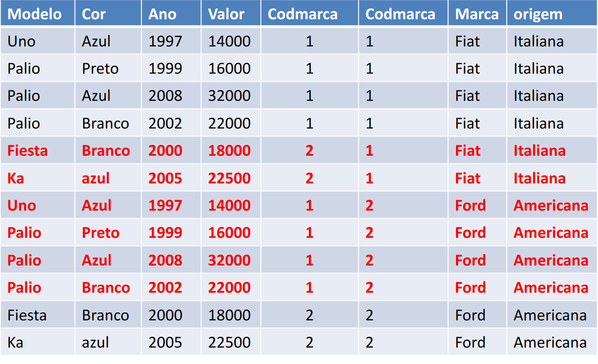

# Data Query Language (DQL)

Data Query Language (DQL) includes commands to retrieve data from a database. The main purpose of DQL is to allow users to perform queries to retrieve specific information stored in the database.

An example of a DQL command in SQL:

- **SELECT**: To query and retrieve specific data from one or more tables, based on criteria defined by the user.

## Cartesian Product

The Cartesian product is a fundamental concept in mathematics that arises from the combination of elements from two distinct sets. By taking two sets, denoted as X and Y, the Cartesian product of these sets is the set of all ordered pairs, where the first element belongs to X and the second belongs to Y.

**Example:**

Let X = {A, B, C, D} and Y = {1, 2, 3}.

The Cartesian product of X and Y, denoted as X * Y, would be:

```
X * Y = {
    (A, 1), (A, 2), (A, 3),
    (B, 1), (B, 2), (B, 3),
    (C, 1), (C, 2), (C, 3),
    (D, 1), (D, 2), (D, 3),
}
```

Essentially, each element of X is combined with each element of Y to form all possible ordered pairs.


### SQL Example

In the context of databases, the Cartesian product is often used in SQL queries to combine all rows from two tables.

```sql
SELECT * FROM table1, table2;
```

In this example, the SQL query returns all possible combinations of rows from the "table1" and "table2" tables.

- **Resulting columns:** 5 columns from the "table1" + 3 columns from the "table2" = 8 columns in total.
- **Resulting rows:** Since there are 6 rows in the "table1" and 2 rows in the "table2", the Cartesian product results in 12 rows.



## Join Queries

In relational databases, the relationship between tables is fundamental to the existence and usefulness of the data. Therefore, it is often necessary to access information by joining tables.

Relationships between tables are established through foreign keys (FK).

## Joins vs Cartesian Product

While for many, joins and Cartesian products may seem the same, there is an important distinction between them. The Cartesian product is characterized by the combination of two or more tables, bringing all possible combinations between them. This includes true and false information.

On the other hand, joins themselves bring only the true information. This is possible thanks to the join condition, which is specified in the WHERE clause or the ON clause in SQL queries. This join condition is always based on foreign keys.

In practice, joins provide more accurate and relevant results, filtering only the combinations that meet the established conditions, while the Cartesian product can generate a large number of combinations, including many that may not be useful or meaningful for the query at hand.


When we need to access information from two related tables in SQL, we use resources like join or Cartesian product.

A table join creates a derived pseudo-table from two or more tables, following specified rules, which are similar to set theory rules.

> **Attention:** It is important to note that when performing a join, we usually prefer to join two tables based on the fields that are foreign keys existing between them. This ensures a direct and meaningful relationship between the data in the involved tables.


```sql
CREATE TABLE DEPARTMENT (
    DEPARTMENT_ID INT NOT NULL PRIMARY KEY,
    NAME VARCHAR(100)
);

CREATE TABLE EMPLOYEE (
    EMPLOYEE_ID INT NOT NULL PRIMARY KEY,
    DEPARTMENT_ID INT NOT NULL,
    NAME VARCHAR(100),
    FOREIGN KEY (DEPARTMENT_ID) REFERENCES DEPARTMENT (DEPARTMENT_ID)
);
```


## Inner Join

Inner join selections return only the data that meets the join condition. This means that only records that have a match in both tables involved will be included in the result.


### Example

Consider two sets A and B:

```
A = {2, 4, 6}
B = {4, 6, 8}
```

The Cartesian product of A and B would be:

```
A * B = {
    (2,4), (2,6), (2,8),
    (4,4), (4,6), (4,8),
    (6,4), (6,6), (6,8)
}
```

However, when applying an INNER JOIN between A and B, only the records that have matches in both sets are returned:

```
A INNER JOIN B = {(4,4), (6,6)}
```

Only the pairs where the first element is in A and the second element is in B are included in the result, according to the established join condition.


### SQL Query and Table Creation

#### Table Creation

```sql
CREATE TABLE DEPARTMENT (
  DEPARTMENT_ID INT NOT NULL PRIMARY KEY,
  NAME VARCHAR(100)
);

CREATE TABLE EMPLOYEE (
  EMPLOYEE_ID INT NOT NULL PRIMARY KEY,
  DEPARTMENT_ID INT NOT NULL,
  NAME VARCHAR(100),
  FOREIGN KEY (DEPARTMENT_ID) REFERENCES DEPARTMENT (DEPARTMENT_ID)
);

-- SQL Query with Inner Join
SELECT	
  DEPARTMENT.DEPARTMENT_ID,
  DEPARTMENT.NAME,
  EMPLOYEE.EMPLOYEE_ID,
  EMPLOYEE.NAME
FROM
  DEPARTMENT
  INNER JOIN EMPLOYEE ON
  DEPARTMENT.DEPARTMENT_ID = EMPLOYEE.DEPARTMENT_ID;
```

### Query Result


## Left Join

Left outer joins return all data from the LEFT table and only the data that meets the join condition from the RIGHT table.


### Example and Query

Considering sets A and B:

```
A = {2, 4, 6}
B = {4, 6, 8}
```

The Cartesian product of A and B would be:

```
A * B = {(2,4), (2,6), (2,8), (4,4), (4,6), (4,8), (6,4), (6,6), (6,8)}
```

When applying a LEFT JOIN between A and B, we have:

```
A LEFT JOIN B = {(2,null), (4,4), (6,6)}
```

This means that all elements of A are kept in the result, while only the elements of B that match A are included, marked with `null` in cases where there is no match.

### SQL Query and Table Creation


```sql
-- Table Creation
CREATE TABLE DEPARTMENT (
  DEPARTMENT_ID INT NOT NULL PRIMARY KEY,
  NAME VARCHAR(100)
);

CREATE TABLE EMPLOYEE (
  EMPLOYEE_ID INT NOT NULL PRIMARY KEY,
  DEPARTMENT_ID INT NOT NULL,
  NAME VARCHAR(100),
  FOREIGN KEY (DEPARTMENT_ID) REFERENCES DEPARTMENT (DEPARTMENT_ID)
);

-- Query with Left Join
SELECT	
  DEPARTMENT.DEPARTMENT_ID,
  DEPARTMENT.NAME,
  EMPLOYEE.EMPLOYEE_ID,
  EMPLOYEE.NAME
FROM
  DEPARTMENT
  LEFT JOIN EMPLOYEE ON
  DEPARTMENT.DEPARTMENT_ID = EMPLOYEE.DEPARTMENT_ID;
```

## Right Join

Right outer joins return all data from the RIGHT table and only the data that meets the join condition from the LEFT table.


### Example and Query

Considering sets A and B:

```
A = {2, 4, 6}
B = {4, 6, 8}
```

The Cartesian product of A and B would be:

```
A * B = {(2,4), (2,6), (2,8), (4,4), (4,6), (4,8), (6,4), (6,6), (6,8)}
```

When applying a RIGHT JOIN between A and B, we have:

```
A RIGHT JOIN B = {(4,4), (6,6), (null,8)}
```

This means that all elements of B are kept in the result, while only the elements of A that match B are included, marked with `null` in cases where there is no match.

### SQL Query and Table Creation

```sql
-- Table Creation
CREATE TABLE DEPARTMENT (
  DEPARTMENT_ID INT NOT NULL PRIMARY KEY,
  NAME VARCHAR(100)
);

CREATE TABLE EMPLOYEE (
  EMPLOYEE_ID INT NOT NULL PRIMARY KEY,
  DEPARTMENT_ID INT NOT NULL,
  NAME VARCHAR(100),
  FOREIGN KEY (DEPARTMENT_ID) REFERENCES DEPARTMENT (DEPARTMENT_ID)
);

-- Query with Right Join
SELECT	
  DEPARTMENT.DEPARTMENT_ID,
  DEPARTMENT.NAME,
  EMPLOYEE.EMPLOYEE_ID,
  EMPLOYEE.NAME
FROM
  DEPARTMENT
  RIGHT JOIN EMPLOYEE ON
  DEPARTMENT.DEPARTMENT_ID = EMPLOYEE.DEPARTMENT_ID;
```

## Other Topics

### [Trigger](./trigger.md)

### [MySQL Functions](./mysql_functions.md)

### [Procedure](./procedure.md)